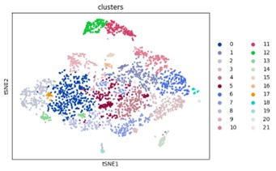

### Q1: T-SNE Results

There are two points of concern for the visualization of learned gene representations. The first is that the clustering of genes is not very obvious, and the second is that it is hard to say that high-correlated genes are near to each other.

For the first point, we clustered the gene representations after dimensionality reduction using the Leiden clustering method [1]. 
We report the visualized genes in Figure 1, and the corresponding genes for different clusters are listed in file GSE_tsne_leiden.txt. In general, genes with similar functions are also close in gene representation space. 

Figure 1: Visualize the gene representation of the GSE240429 dataset by TSNE and Leiden cluster

For example, cluster 19 predominantly includes genes encoding ribosomal proteins (e.g., RPS8, RPS27, RPL31, RPL37A), which are essential components of the ribosome. Cluster 11 and Cluster 12 consist of genes with AC and AL prefixes, often associated with uncharacterized transcripts or regions with potential non-coding functions.

For the second point, we calculate the average distance or similarity between high-correlated genes and anchor genes, as well as between low-correlated genes and anchor genes. We use Euclidean distance, manhattan distance, and cosine similarity for measurement. As shown in Table 1, for different genes in Figure 3 of the paper, the overall average distance between high-correlated genes and anchor genes is closer and the similarity is higher. In the table, HRG represents high-correlated genes, and LCG represents low-correlated genes.

Table 1: the distance and similarity for genes
| Gene | euclidean distance | $\downarrow$ |manhattan_distance | $\downarrow$ |cosine_similarity |$\uparrow$ |
| --- | --- | --- | --- | --- | --- | --- | 
|  | HCG | LCG |HCG | LCG | HCG| LCG|
|DCN|56.911| 60.119 |74.603| 80.291 |-0.008 |-0.383 |
|ORM1| 49.954| 91.706| 53.936| 114.196| 0.583| -0.411 |
|SAA2| 48.679|  74.376| 51.977| 90.606 |0.587 |0.070| 

[1] Vincent A Traag, Ludo Waltman, and Nees Jan Van Eck. From louvain to leiden: guaranteeing well-connected communities Scientific Reports, 9(1):5233, 2019.319
